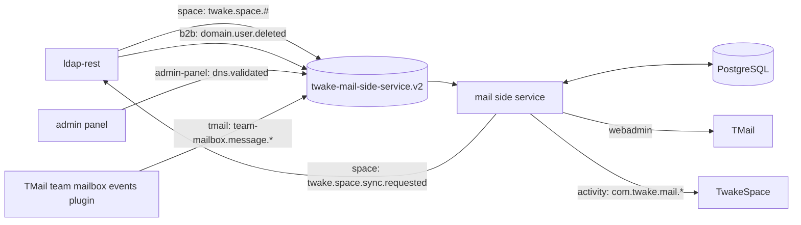
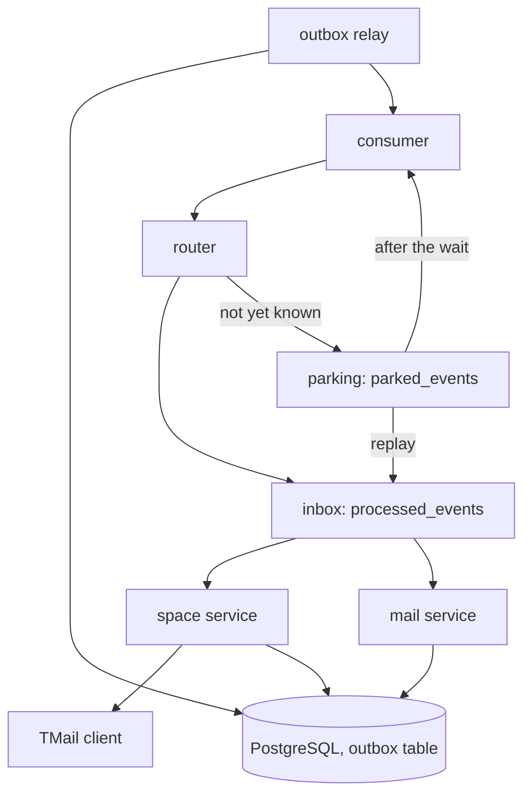
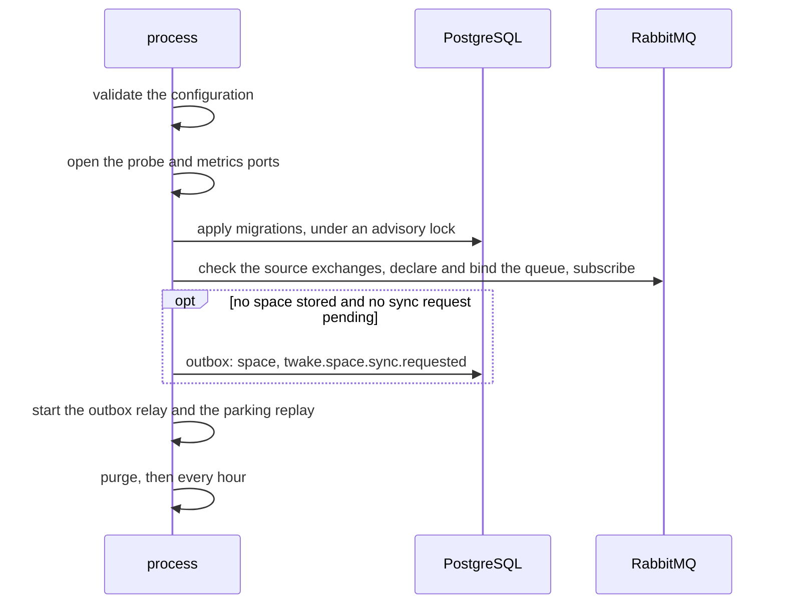
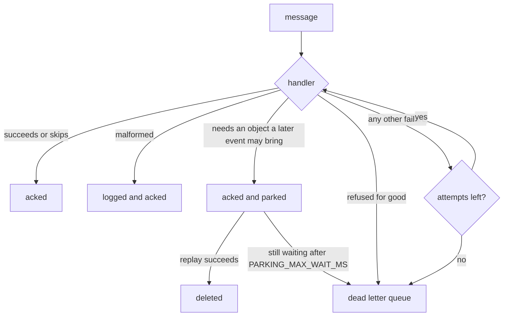

# Architecture

The service gives each TwakeSpace space a TMail team mailbox. It follows the space and its members from ldap-rest events, manages the mailbox through TMail's webadmin API, and reports the mailbox's mail to the space feed.

It is a queue consumer with no API of its own. Everything it does starts from a RabbitMQ event, except the sync request at its first start and the hourly purge. It listens on two HTTP ports: one for the probes, one for the metrics.

## Context

[Dependencies](dependencies.md) describes each system, and [events](events.md) each message.

## Inside the service

- The consumer declares the queue, binds it to the four source exchanges and hands each message to the router. Its RabbitMQ connection also publishes for the relay and the parking.
- The router picks the handler from the routing key alone, and records the outcome of each attempt (see [metrics](operations.md#metrics)).
- The inbox runs each event once (see [ordering and retries](#ordering-and-retries)).
- The space service handles space, member, DNS and user events, provisions and closes team mailboxes, and runs the purge. See [team mailboxes](team-mailboxes.md).
- The mail service turns team mail events into activity events.
- The services publish nothing themselves. They write each message to the `outbox` table in the transaction that stores what it describes. Every `OUTBOX_INTERVAL_MS`, while RabbitMQ is connected, the relay sends the pending rows in id order, with publisher confirms, and deletes each one the broker confirmed. A failed publish ends the run and the next run retries it. A transaction scoped advisory lock keeps a single replica relaying.
- The TMail client makes one HTTP call per operation, with a 10 second timeout. Retries come from the queue. [Dependencies](dependencies.md#tmail) says how each answer is handled.
- State lives in PostgreSQL. See [data model](data-model.md).

## Startup and shutdown

- RabbitMQ gets 5 connection attempts, 5 seconds apart, at startup.
- An invalid configuration, a failed migration, an unreachable RabbitMQ or a missing source exchange stops the process with code 1, after reporting the error to Sentry.
- The purge deletes the team mailboxes of spaces deleted over 30 days ago, and the `processed_events` rows older than 7 days.
- On SIGTERM or SIGINT, the service stops the parking replay and the relay, stops consuming (waiting up to half of `SHUTDOWN_TIMEOUT_MS` for the messages in hand), closes the database and the HTTP ports, and exits. It is forced out after `SHUTDOWN_TIMEOUT_MS`.
- An uncaught exception or unhandled rejection shuts it down with code 1.
- After a RabbitMQ reconnect that fails to restore the subscription, the process shuts down with code 1, so that it is restarted.

## Ordering and retries

- Every replica reads the queue, each handling up to `RABBITMQ_PREFETCH` events at once, so events arrive out of order.
- Order is kept per space. A handler holds a Postgres advisory lock on the space for its whole run, TMail calls included, so two events about one space never run at once. It reads the space once it holds the lock, and skips an event older than the last one applied to the space or, for a member event, to that member.
- An event about several spaces (sync completed, DNS validated, user deleted) takes each space's lock in turn. It handles every space, then fails if one failed, so the retry only redoes what is left.
- Each event is handled once. When its handler succeeds, a `processed_events` row records it, keyed by the AMQP message id (team mail: by team mailbox, message id and direction). A copy delivered meanwhile to another replica waits on a lock on that key, then finds the row and is acked untouched.
- Handlers commit each step as they go, so a crash before the row is written runs the handler again, which their idempotent steps allow.
- Each lock lives on a connection of its own, so an event in hand holds up to two. The pool holds twice `RABBITMQ_PREFETCH` plus 8 connections, so queries, the relay, the parking and the purge always find one.

What happens to a message depends on how its handler ends:

- A failing handler runs at most `RABBITMQ_MAX_RETRIES` times in process, waiting `RABBITMQ_RETRY_DELAY` after the first attempt and twice as long after each next one, up to `RABBITMQ_MAX_RETRY_DELAY`. Then the message goes to the dead letter queue `twake-mail-side-service.v2.dlq`.
- A message whose retries are cut short by a shutdown or a reconnect is redelivered. The queue dead letters it after 20 deliveries.
- A body that is not JSON goes to the dead letter queue at once. A JSON body that fails validation is logged and acked, since no retry can fix it.
- An event refused for good, such as a space whose address is a team mailbox no space holds, goes to the dead letter queue at once.
- An event that needs an object a later event may bring is parked: acked and stored in `parked_events`. Examples: a member change or rename of a space not created yet, mail of a space still being provisioned, a domain or team mailbox TMail does not have yet.
- Every `PARKING_INTERVAL_MS`, while RabbitMQ is connected, one replica replays the parked events through their handler. It holds a lock on a connection of its own, with no transaction open.
- A parked event still waiting after `PARKING_MAX_WAIT_MS` is published to the dead letter exchange, with the routing key RabbitMQ gives every dead letter (`twake.space.#.dead`), so it reaches the dead letter queue with its original exchange, routing key and last error in the `x-original-exchange`, `x-original-routing-key` and `x-parked-reason` headers.
- Nothing replays a dead letter on its own, since it could apply an old event over newer ones. [Operations](operations.md#dead-letters) says what repairs each kind.
