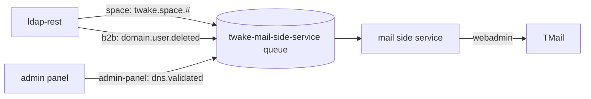

# Architecture

The service gives each TwakeSpace space a TMail team mailbox. It follows the space and its members from ldap-rest events, and manages the mailbox with TMail's webadmin API.

## Events consumed

The service reads one quorum queue, bound to three exchanges:

- `space`, routing key `twake.space.#`: spaces created, renamed and deleted, and members added, removed or given another role. Published by ldap-rest.
- `admin-panel`, routing key `dns.validated`: an organization's mail domain passed DNS validation. Published by the admin panel.
- `b2b`, routing key `domain.user.deleted`: a user was deleted. ldap-rest publishes no space member event for a deleted user.

The routing key picks the handler. A message with no handler is acked and counted as `ignored`.

## Ordering and retries

- The queue has single active consumer on, so with several replicas one reads at a time and events are handled in publish order.
- A failing handler is retried in process `RABBITMQ_MAX_RETRIES` times, then the message goes to the dead letter queue `twake-mail-side-service.dlq`.
- The source exchanges belong to their publishers, so the service only checks that they exist and fails to start when one is missing.
