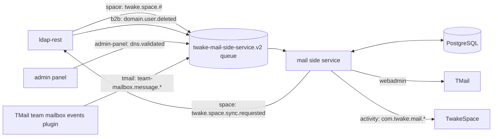
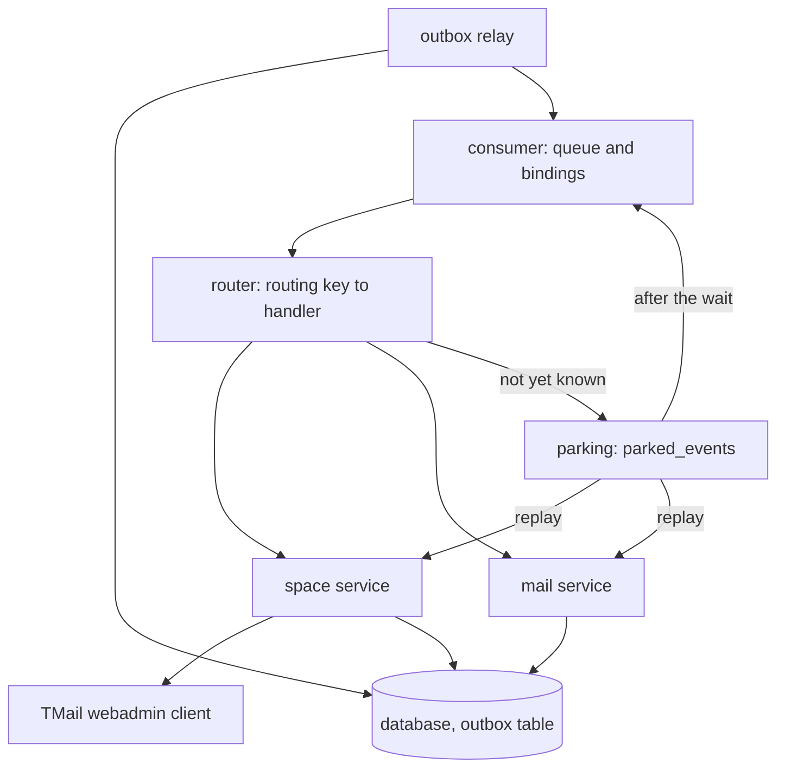
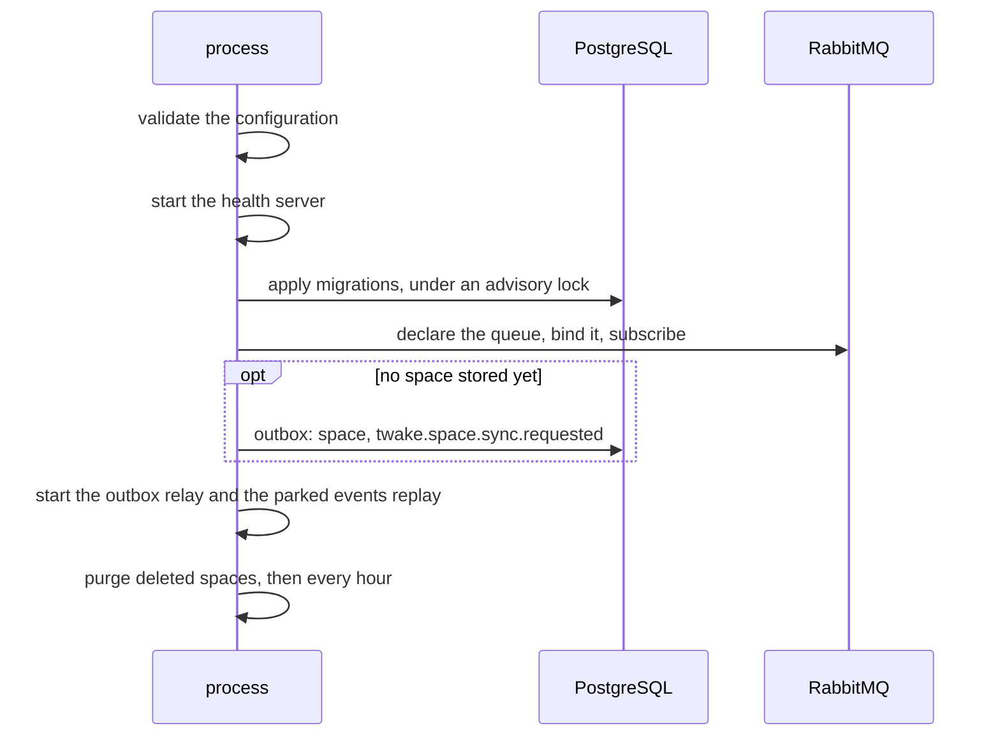

# Architecture

The service gives each TwakeSpace space a TMail team mailbox. It follows the space and its members from ldap-rest events, and manages the mailbox with TMail's webadmin API. It reports the mail of each team mailbox to the space feed.

It is a queue consumer with no API of its own: everything it does starts from a RabbitMQ event, except the sync request at its first start and the hourly purge of deleted spaces. Its HTTP port only serves health and metrics.

## Context

[Dependencies](dependencies.md) describes each system, and [events](events.md) each message.

## Inside the service

- The consumer declares the queue, binds it to the four source exchanges, and hands each message to the router. Its RabbitMQ connection also publishes what the relay sends.
- The services publish nothing themselves. They write each event to the `outbox` table in the transaction that stores what it describes. Every `OUTBOX_INTERVAL_MS`, while RabbitMQ is connected, the relay sends the pending rows in id order, with publisher confirms, and deletes each one the broker confirmed. A failed publish ends the run, and the next run retries it. A transaction-scoped advisory lock keeps a single replica relaying.
- The router picks the handler from the routing key alone, and records a metric for each attempt.
- The space service handles space, member, DNS and user events, provisions and closes team mailboxes, and runs the purge. See [team mailboxes](team-mailboxes.md).
- The mail service turns team mail events into activity events.
- The TMail client makes one HTTP call per operation, with a 10 second timeout. Retries come from the queue. See [dependencies](dependencies.md#tmail) for how each answer is handled.
- State lives in PostgreSQL. See [data model](data-model.md).

## Startup and shutdown

- An invalid configuration, a failed migration or a missing source exchange stops the process with code 1.
- On SIGTERM or SIGINT, the service stops the parked events replay and the relay, stops consuming, closes the database and the health server, and exits. It is forced out after `SHUTDOWN_TIMEOUT_MS`.
- An uncaught exception or unhandled rejection shuts it down with code 1.

## Ordering and retries

- Every replica reads the queue, each handling up to `RABBITMQ_PREFETCH` events at once, so events arrive out of order.
- Order is kept per space. A handler holds a Postgres advisory lock on the space for its whole run, TMail calls included, so two events about one space never run at once. It reads the space once it holds the lock, and skips an event older than the last one applied to the space, or, for a member event, to that member. An event about many spaces (sync completed, DNS validated, user deleted) takes each space's lock in turn. A lock lives on a connection of its own; transactions stay short and never span a TMail call.
- Each event is handled once. When its handler succeeds, a row of `processed_events` records it, keyed by the AMQP message id (team mail: by team mailbox, message id and direction). A copy delivered meanwhile to another replica waits on a lock on that key, then finds the row and is acked untouched. Rows are kept 7 days. Handlers commit each step as they go, so a crash before the row is written runs the handler again, which its idempotent steps allow.
- A failing handler runs at most `RABBITMQ_MAX_RETRIES` times in process (attempts, not retries), waiting `RABBITMQ_RETRY_DELAY` after the first and twice as long after each next one, up to `RABBITMQ_MAX_RETRY_DELAY`. Then the message goes to the dead letter queue `twake-mail-side-service.v2.dlq`. Nobody replays it, since it could apply an old event over newer ones.
- What repairs a dead letter depends on the event:
  - Space, member and user deletion events: the next sync of the space.
  - A DNS event: the next sync, when the organization's domain was stored before the failure. Otherwise its spaces wait until the admin panel validates it again, see [operations](operations.md#organizations-validated-before-the-first-deployment).
  - A team mail event: nothing. That message never shows in the space feed.
- A malformed event is logged and dropped, since no retry or replay can fix it.
- An event refused for good, such as a space whose address is a team mailbox no space holds, goes straight to the dead letter queue.
- An event that needs an object a later event may still bring (a member change or rename of a space not created yet, mail of a space still being provisioned, a domain or team mailbox TMail does not have yet) is parked: acked and stored in `parked_events`. Every `PARKING_INTERVAL_MS` one replica replays the parked events through their handler. One still not applicable after `PARKING_MAX_WAIT_MS` is published to the dead letter exchange, with the routing key RabbitMQ gives every dead letter, so it reaches the dead letter queue with its original exchange, routing key and last error in the `x-original-exchange`, `x-original-routing-key` and `x-parked-reason` headers.
- An event about several spaces (a DNS event, the end of a sync) handles each one, then fails if any failed, so the retry only redoes what is left.
- The source exchanges belong to their publishers, so the service only checks that they exist and fails to start when one is missing.
- After a RabbitMQ reconnect that fails to restore the subscription, the process exits with code 1 so that it is restarted.
