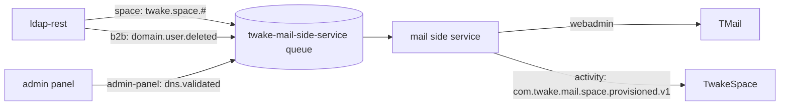
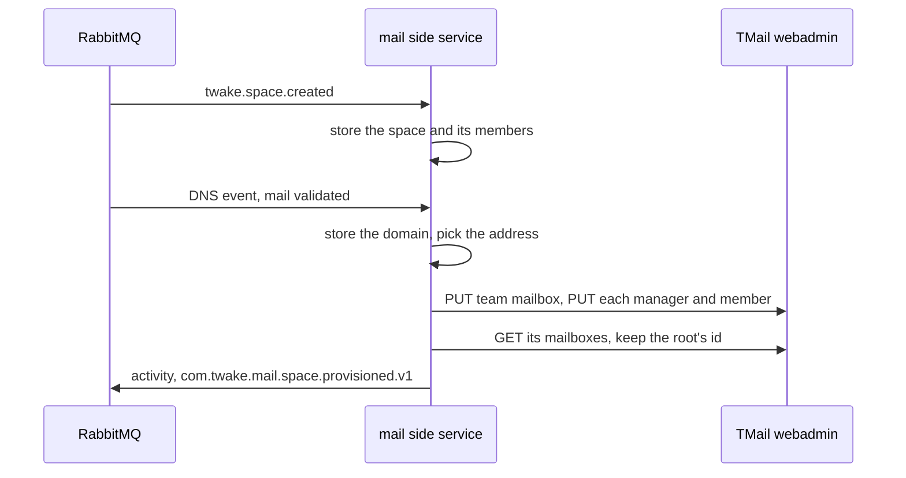

# Architecture

The service gives each TwakeSpace space a TMail team mailbox. It follows the space and its members from ldap-rest events, and manages the mailbox with TMail's webadmin API.

## Events consumed

The service reads one quorum queue, bound to three exchanges. The names below are the defaults; [operations](operations.md) lists the settings.

- `space`, routing key `twake.space.#`: published by ldap-rest. The service handles `twake.space.created` and the member events (added, removed, role changed). Renamed and deleted spaces are not handled yet.
- `admin-panel`, routing key `dns.validated`: an organization's mail domain passed DNS validation. Published by the admin panel.
- `b2b`, routing key `domain.user.deleted`: a user was deleted. ldap-rest publishes no space member event for a deleted user.

The routing key picks the handler. A message with no handler is acked and counted as `ignored`.

## Provisioning

- The service stores each space, its members and their roles, and each organization's mail domain, since later events only carry ids.
- A space gets its team mailbox once its organization's mail DNS is validated: when the space is created if the DNS event came first, otherwise when the DNS event arrives.
- The address comes from the space name: accents dropped, lowercased, any character other than a letter, a digit, `-` or `_` replaced by `-`, at most 64 characters. When another space or a TMail team mailbox, user or alias holds it, `-2`, `-3` and so on up to `-20` are added. Renaming the space keeps the address.
- The address is stored before the mailbox is created in TMail, so a retry resumes with the same one.
- Admins are managers and editors are members. Viewers get no access, since TMail team mailboxes have no read-only access.
- Once the members are added, the service reads the id of the team mailbox's root mailbox and publishes `com.twake.mail.space.provisioned.v1` with the space id and that id as the mailbox id. It is the JMAP mailbox id the Twake Mail embed opens.
- A deleted user is removed from every team mailbox they were in.
- A malformed event goes straight to the dead letter queue.

## Ordering and retries

- The queue has single active consumer on, so with several replicas one reads at a time and events are handled in publish order.
- A failing handler runs at most `RABBITMQ_MAX_RETRIES` times in process (attempts, not retries), then the message goes to the dead letter queue `twake-mail-side-service.dlq`.
- The source exchanges belong to their publishers, so the service only checks that they exist and fails to start when one is missing.
- After a RabbitMQ reconnect that fails to restore the subscription, the process exits with code 1 so that it is restarted.
