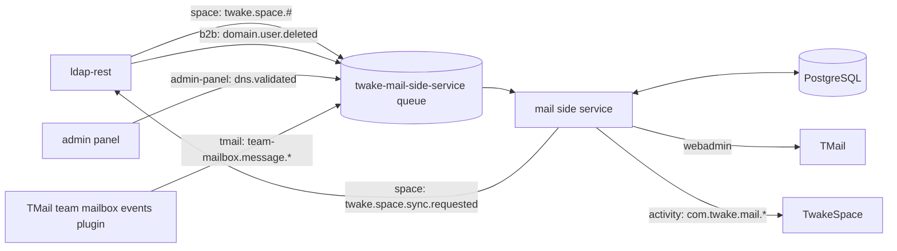
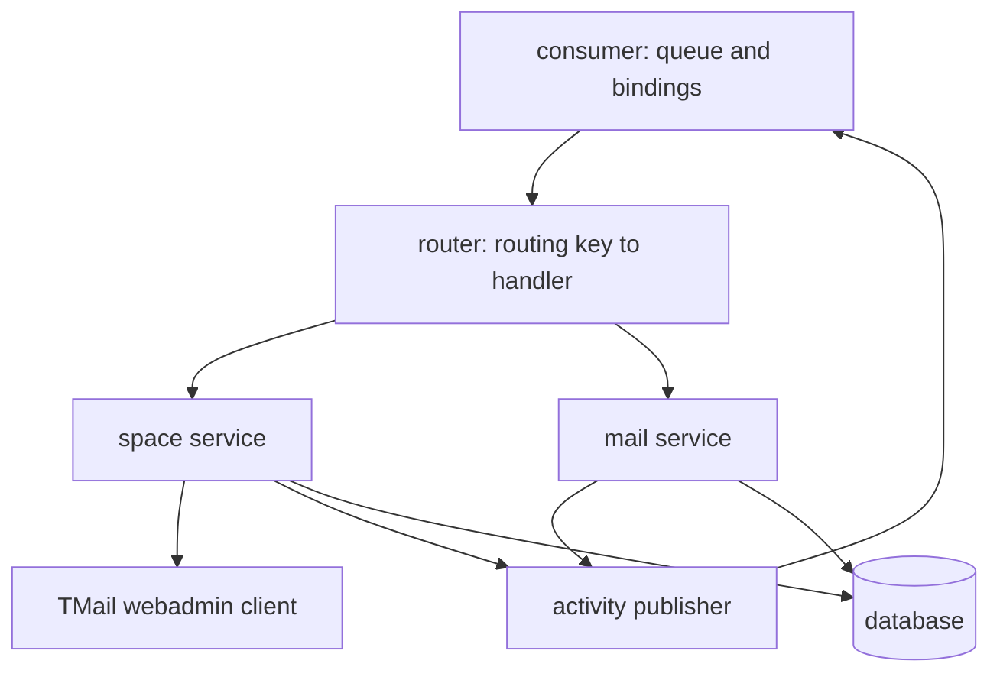
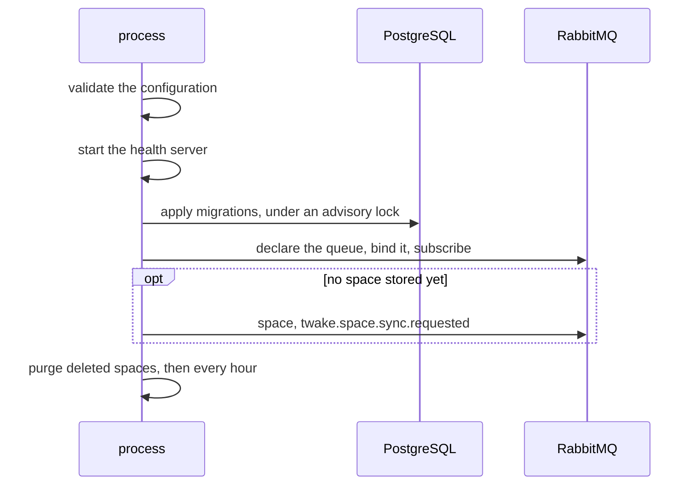

# Architecture

The service gives each TwakeSpace space a TMail team mailbox. It follows the space and its members from ldap-rest events, and manages the mailbox with TMail's webadmin API. It reports the mail of each team mailbox to the space feed.

It is a queue consumer with no API of its own: everything it does starts from a RabbitMQ event, except the hourly purge of deleted spaces. Its HTTP port only serves health and metrics.

## Context

[Dependencies](dependencies.md) describes each system, and [events](events.md) each message.

## Inside the service

- The consumer declares the queue, binds it to the four source exchanges, and hands each message to the router. Its RabbitMQ connection also publishes the activity events.
- The router picks the handler from the routing key alone, and records a metric for each attempt.
- The space service handles space, member, DNS and user events, provisions and closes team mailboxes, and runs the purge. See [team mailboxes](team-mailboxes.md).
- The mail service turns team mail events into feed events.
- The TMail client makes one HTTP call per operation, with a 10 second timeout. Retries come from the queue.
- State lives in PostgreSQL. See [data model](data-model.md).

## Startup and shutdown

- An invalid configuration, a failed migration or a missing source exchange stops the process with code 1.
- On SIGTERM or SIGINT, the service stops consuming, closes the database and the health server, and exits. It is forced out after `SHUTDOWN_TIMEOUT_MS`.
- An uncaught exception or unhandled rejection shuts it down with code 1.

## Ordering and retries

- The queue has single active consumer on, so with several replicas one reads at a time and events are handled in publish order.
- A failing handler runs at most `RABBITMQ_MAX_RETRIES` times in process (attempts, not retries), then the message goes to the dead letter queue `twake-mail-side-service.dlq`. Nobody replays it, since it could apply an old event over newer ones; the next sync repairs the space.
- A malformed event goes straight to the dead letter queue.
- An event about several spaces (a DNS event, the end of a sync) handles each one, then fails if any failed, so the retry only redoes what is left.
- The source exchanges belong to their publishers, so the service only checks that they exist and fails to start when one is missing.
- After a RabbitMQ reconnect that fails to restore the subscription, the process exits with code 1 so that it is restarted.
