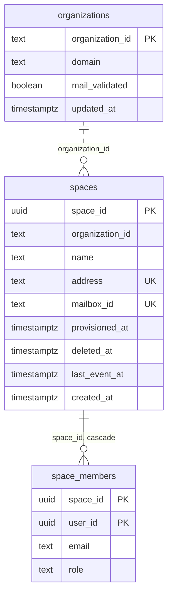
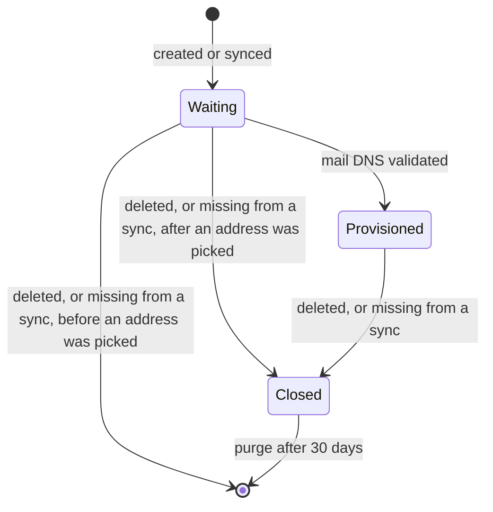

# Data model

The service keeps its own state in PostgreSQL, because most events carry only ids: a member event names the space but not its organization's domain, and a deleted user arrives as a bare uuid. The tables are defined in `src/schema.ts`.

There is no foreign key from `spaces` to `organizations`: a space can be created before its organization's DNS event arrives.

## organizations

One row per organization the admin panel sent a DNS event for.

- `domain`: the mail domain, lowercased. Team mailboxes are created under it.
- `mail_validated`: the last `mailDnsConfigurationValidated` received. Spaces are provisioned only when it is true.

## spaces

One row per space, from its creation until 30 days after its deletion.

- `name`: the current space name. It only matters until the space is provisioned, since the address is picked from it once.
- `address`: the team mailbox address, `<name>@<domain>`, lowercased. Unique, so two spaces never get the same one. Set before the mailbox is created in TMail.
- `mailbox_id`: the JMAP id of the team mailbox's root mailbox, published in the provisioned event.
- `provisioned_at`: set once the mailbox exists and its members are added, in the transaction that writes the provisioned event to the outbox. A space with no `provisioned_at` is waiting.
- `deleted_at`: set when the space is deleted. The row stays, holding its address, until the purge deletes the mailbox.
- `last_event_at`: the newest event timestamp applied to the space. Older events are ignored.

A space's state follows from these columns:

## space_members

The members of each live space, with their space role (`viewer`, `editor` or `admin`). A member removal event deletes its rows, and a sync replaces all of a space's rows. Rows are also removed when the space is closed or purged, and when the user is deleted. The index on `user_id` serves user deletion.

## outbox

The messages written but not yet confirmed by the broker: exchange, routing key, message id and body, in `id` order. The relay deletes a row once the broker confirms it, so the table is empty in steady state. Rows that stay mean RabbitMQ is unreachable or refuses them; the relay logs each failure.

## parked_events

The events waiting for an object a later event may bring: their message properties, body, the last reason they could not be applied and when they were parked. A row is deleted once its replay succeeds or it goes to the dead letter queue, so the table is empty in steady state.

## Migrations

Migrations live in `drizzle/` and are generated from `src/schema.ts` with `npm run db:generate`. The service applies them at startup, under a PostgreSQL advisory lock, so replicas starting together do not apply the same one twice. The image ships the `drizzle/` folder next to `dist/`.
