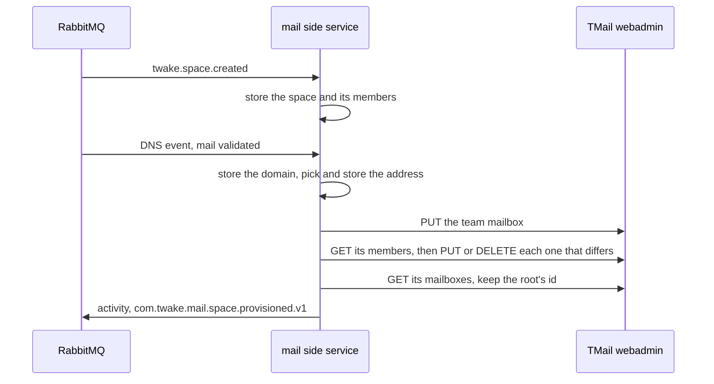

# Team mailboxes

How a space's team mailbox is created, kept in step with the space, reported to the feed and deleted. The payloads are in [events](events.md), the stored state in [data model](data-model.md).

## Provisioning

- The service stores each space, its members and their roles, and each organization's mail domain, since later events only carry ids.
- A space gets its team mailbox once its organization's mail DNS is validated: when the space is created if the DNS event came first, otherwise when the DNS event arrives.
- The address comes from the space name: accents dropped, lowercased, every run of characters other than a letter, a digit, `-` or `_` replaced by one `-`, dashes trimmed from both ends, at most 64 characters (`space` when nothing is left). When another space or a TMail user or alias holds it, `-2`, `-3` and so on up to `-20` are added.
- The address is stored before the mailbox is created in TMail, so a retry resumes with the same one.
- When the address is a TMail team mailbox that no space holds, the service does not provision the space and sends the event to the dead letter queue. The mailbox may be this space's from a lost database row, and only a person can tell. [Operations](operations.md#a-space-whose-address-is-already-a-team-mailbox) explains the repair.
- A space gets one team mailbox, never a second.
- Admins are managers and editors are members. Viewers get no access, since TMail team mailboxes have no read only access.
- Once the members match, the service reads the id of the team mailbox's root mailbox and publishes `com.twake.mail.space.provisioned.v1` with the space id and that mailbox id. It is the JMAP mailbox id the Twake Mail embed opens.

## Members

- A member event changes only the members it names, in the space and, once the space is provisioned, in TMail.
- Renaming a space still waiting for its mailbox changes the address it will get. Renaming a provisioned space keeps its address.
- A deleted user is removed from every team mailbox they were in.

## Deletion

- When a space is deleted, the service removes every member of its team mailbox in TMail. The mailbox and its mail stay, with no one able to open them.
- 30 days later, the purge deletes the team mailbox. Until then the space keeps its address, so no other space gets it.
- The purge runs at startup and every hour. A deletion TMail fails is tried again at the next run.
- A deleted space stays deleted: a replayed creation or sync naming it is skipped, as are its member events and its mail.

## Sync

ldap-rest publishes a snapshot of the spaces when asked with `twake.space.sync.requested`. It repairs what an event lost or a dead letter left behind.

- On `twake.space.synced`, the service makes the team mailbox match the space: its members and roles, read from TMail, so a member added there by hand is removed too. A space it never heard of is stored and provisioned like a created one.
- On `twake.space.sync.completed`, the service closes, as on a deletion, the spaces of the organization the snapshot no longer lists. A space whose last event is newer than the snapshot stays.
- On a start with no space stored, the service requests a sync of every organization, which provisions the spaces created before it was deployed.

## Mail activity

- For each team mail event, the service finds the space by its team address and publishes `com.twake.mail.message.received.v1` or `com.twake.mail.message.sent.v1` on the activity exchange.
- The event's object is the message: its id, and its subject as the title (`(no subject)` when empty). Its container is the root mailbox id announced at provisioning. TwakeSpace builds the link that opens it from those ids.
- The event id is the mailbox id, the message id and the direction, so a redelivered event is not shown twice.
- The event names no actor and has no preview: the sender of a received mail is not a member, the plugin does not say which member sent a team mail, and viewers have no access to the mailbox.
- Mail of a team mailbox that no live space owns is logged and acked. Mail of a space still being provisioned is parked until the space is, since its provisioned event has to come first.
